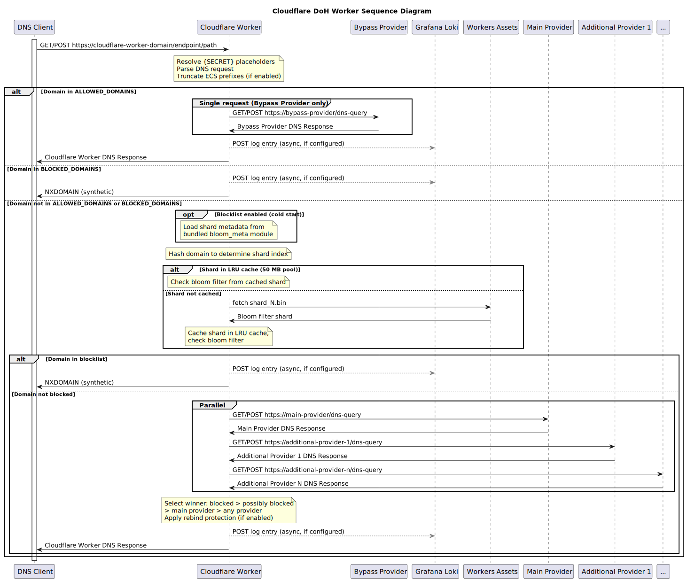

# Cloudflare DoH Worker

If you're using DNS to block malicious domains (NextDNS, Cloudflare, Quad9, etc), you'll find that it doesn't always block something that it should.

I always thought it would be neat to have a way to query multiple DNS providers and block the domain if **any** of them filter it, essentially combining the responses and responding appropriately based on a set of conditions. Now I can! You can see the application flow in the diagram below.

This project builds on [the solution I put in place for our family](https://www.lauder.family/blog/2021/09/25/Avoiding-DoH-Detection-and-Blocking/), when our school division started blocking DoH on my kids devices. I launched a Cloudflare Worker and used that to proxy to NextDNS, using a custom domain that they wouldn't easily detect and block. That solution proxied back to a single DNS provider (NextDNS). This project takes that idea and adds support for proxying, in parallel, to any number of DNS providers and leveraging the filtering capability that you want in all of them.

You can also send request logs to Grafana Loki to perform your own analytics and monitoring.

## Todo

- Tests need to be written to validate various response scenarios
- Add support for allowlist and blocklist directly in the worker to override provider responses

## Design



### Requirements

- [NodeJS](https://nodejs.org)
- Cloudflare Account
  - The _free_ tier is adequate for us but you will need to determine that for youself.
- Grafana Loki (optional)
  - Send request logs to a Grafana Loki instance. The _free_ tier on Grafana Cloud is adequate for us.
- Docker (optional)
  - A docker compose manifest and dockerfile are included if you wish to run the worker locally.

## Quickstart Deploy

Use this button to deploy this worker to your Cloudflare account.

[](https://deploy.workers.cloudflare.com/?url=https://github.com/trevorlauder/cloudflare-doh-worker)

- Update `wrangler.toml` and `src/config.js` **in your new repo** created by Cloudflare, based on your needs. See additional details on `src/config.js` under [Manual Deploy](https://github.com/trevorlauder/cloudflare-doh-worker?tab=readme-ov-file#manual-deploy).

- Add `LOKI_USERNAME` and `LOKI_PASSWORD` secrets for your worker, if you are using Grafana Loki.

## Manual Deploy

- Update `wrangler.toml` based on your needs.

- Update `src/config.js`.

  Modify the configuration for your needs. You can create as many endpoints as you need and they can each be configured to proxy to specific DNS providers. If you want to include headers, you can do that like I'm doing in the NextDNS example.

  Only one provider should have `main: true`. If more than one in each path is marked as **main**, you will receive an error on your DNS requests.

  ```javascript
  const debug = false

  const loki = {
    enabled: false,
    url: "",
  }

  const endpoints = {
    "/my/doh/path": {
      dohProviders: [
        {
          host: "dns11.quad9.net",
          path: "/dns-query",
        },
        {
          host: "cloudflare-dns.com",
          path: "/dns-query",
        },
        {
          main: true,
          host: "dns.nextdns.io",
          path: "/abc123",
          headers: {
            "X-Device-Name": "My Device",
            "X-Device-Model": "My Device Model",
          },
        },
      ],
    },
  }

  export { debug, loki, endpoints }
  ```

- Create `config.capnp` (optional).

  If you plan to run the worker locally in docker, you'll need to perform this step. Otherwise ignore it.

  If you want logs from the docker instance to be sent to your Grafana Loki instance, set your API username and password in this file.

  ```capnp
  using Workerd = import "/workerd/workerd.capnp";

  const config :Workerd.Config = (
    services = [
      (name = "main", worker = .mainWorker),
    ],

    sockets = [
      ( name = "http",
        address = "*:8080",
        http = (),
        service = "main"
      ),
    ]
  );

  const mainWorker :Workerd.Worker = (
      modules = [
        (
          name = "main",
          esModule = embed "dist/index.js",
        )
      ],
      compatibilityDate = "2025-05-06",
      compatibilityFlags = ["nodejs_compat"],
      bindings = [
        ( name = "LOKI_USERNAME", text = "" ),
        ( name = "LOKI_PASSWORD", text = "" ),
      ],
  )
  ```

- Install the project requirements.

  ```shell
  npm install -u
  ```

- Deploy the worker to your Cloudflare account.

  The first time you run this, it will need to log into your Cloudflare account and provide permission for Wrangler.

  ```shell
  npm run deploy
  ```

That's it, you should be able to use the worker along with your endpoint paths to configure DoH on your devices.

You can send logs for each DNS request to Grafana Loki. You'll need to add the credentials to your Cloudflare Worker, enable Loki and add the URL to `src/config.js`.

```shell
npx wrangler secret put LOKI_USERNAME
npx wrangler secret put LOKI_PASSWORD
```

## Known Issues

- The script does support `application/dns-json` but not all providers implement that properly. It is recommended you use `application/dns-message` for your DoH queries to the endpoint. This should be the default on many of the clients.

## Docker Compose

A docker compose file is provided to get you started. You'll need to generate an SSL certificate and save the certificate as `nginx/ssl/tls.crt` and the private key as `nginx/ssl/tls.key`.

You can generate a self-signed certificate using the sample command below.

```shell
mkdir nginx/ssl

openssl req -x509 -newkey ec -pkeyopt ec_paramgen_curve:prime256v1 -nodes -keyout nginx/ssl/tls.key -out nginx/ssl/tls.crt -days 3650 -subj '/CN=doh-worker'
```
