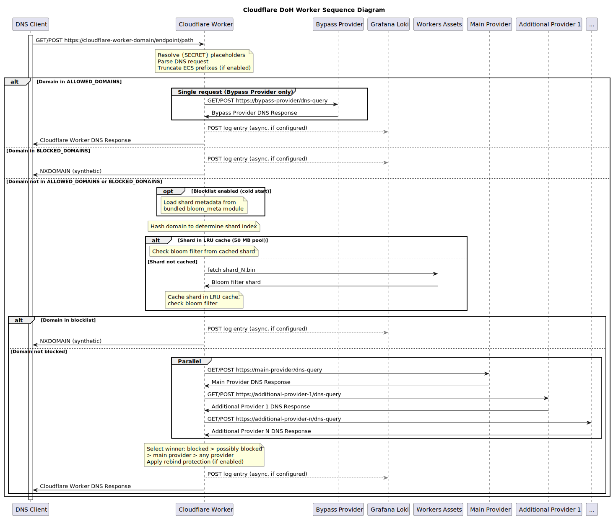

# Cloudflare DoH Worker

[](https://github.com/trevorlauder/cloudflare-doh-worker/actions/workflows/ci.yml)

> [!IMPORTANT]
> This is a complete rewrite in Python and is currently in release candidate. If you want the previous JavaScript version, use the [0.9.0 release](https://github.com/trevorlauder/cloudflare-doh-worker/tree/0.9.0). The JavaScript version will no longer receive updates.

A Cloudflare Worker that fans out DNS-over-HTTPS queries to multiple upstream providers in parallel and returns the most restrictive result. If **any** provider blocks a domain, it's blocked.

This started as [a workaround](https://www.lauder.family/blog/2021/09/25/Avoiding-DoH-Detection-and-Blocking/) when our school division blocked DoH on my kids' devices. It was a simple Cloudflare Worker proxying to NextDNS on a custom domain. This version takes that further, letting you proxy to as many DoH providers as you want and combine their filtering.

## Features

- Fan-out to multiple DoH providers, pick the most restrictive answer
- Per-domain blocklist and allowlist in `src/config.py` to ensure specific domains are always blocked or never blocked, regardless of upstream provider responses (not meant for huge community lists due to Worker resource limits)
- Allowed domains skip fan-out and go straight to a non-filtering bypass provider (default: Cloudflare)
- EDNS Client Subnet prefix truncation for privacy
- DNS rebind protection (blocks responses resolving to private IPs)
- `${SECRET_NAME}` placeholders in config, resolved from Cloudflare Worker secrets at request time
- Health check and live config inspection endpoints (`CONFIG_ENDPOINT` requires `ADMIN_TOKEN`)
- Debug mode adds diagnostic response headers
- Automatic retry on 5xx responses from upstream providers
- Optional Grafana Loki logging
- Supports both `dns-message` and `dns-json` content types

## Quickstart Deploy

Use this button to deploy this worker to your Cloudflare account.

[](https://deploy.workers.cloudflare.com/?url=https://github.com/trevorlauder/cloudflare-doh-worker/tree/deploy-1.0.0-rc6)

- Update `wrangler.toml` and `src/config.py` **in your new repo** created by Cloudflare, based on your needs. See [Configuration](#configuration) for details.

- Add any secrets referenced in your config via `${SECRET_NAME}` placeholders:

  ```shell
  # Add each secret referenced in your config, for example:
  npx wrangler secret put LOKI_PASSWORD
  ```

  Common optional secrets:

  | Secret          | Required when              |
  | --------------- | -------------------------- |
  | `ADMIN_TOKEN`   | `CONFIG_ENDPOINT` is set   |
  | `LOKI_URL`      | Using Grafana Loki logging |
  | `LOKI_USERNAME` | Using Grafana Loki logging |
  | `LOKI_PASSWORD` | Using Grafana Loki logging |

## Manual Deploy

- Fork this repo on GitHub, then clone your fork and reset `main` to the latest deploy tag:

  ```shell
  git clone https://github.com/your-username/cloudflare-doh-worker.git
  cd cloudflare-doh-worker
  git checkout -B main deploy-1.0.0-rc6
  git push --force-with-lease origin main
  ```

- Update `wrangler.toml` with your routes/domains.

- Update `src/config.py` with your endpoint paths and provider details. See [Configuration](#configuration).

- Add your secrets as shown in [Quickstart Deploy](#quickstart-deploy).

- Install [mise](https://mise.jdx.dev), then install dependencies:

  ```shell
  mise install
  uv sync
  ```

- Deploy:

  ```shell
  uv run pywrangler deploy
  ```

  The first time you run this, it will need to log into your Cloudflare account and provide permission for Wrangler.

## Updating

Check [CHANGELOG.md](CHANGELOG.md) and the [release notes](https://github.com/trevorlauder/cloudflare-doh-worker/releases) before updating to see if any config changes are required.

Add this repo as an upstream remote (only needed once), then merge the new deploy tag:

```shell
git remote add upstream https://github.com/trevorlauder/cloudflare-doh-worker.git
git fetch upstream
git merge --allow-unrelated-histories deploy-1.0.0  # replace with the new version tag
```

Resolve any conflicts in `src/config.py`, `wrangler.toml`, and `package.json` to preserve your customizations (the `name` field in `wrangler.toml` and `package.json` will always conflict), then redeploy.

## Requirements

- A Cloudflare account (free tier should be fine for personal use)
- [mise](https://mise.jdx.dev) for installing dependencies (`uv`, `node`, `python`)
- Grafana Loki (optional, for request logging)

## Configuration

All config lives in `src/config.py`. You can define as many endpoint paths as you need. Each one proxies to its own set of upstream DoH providers.

Each endpoint has one `main_provider` (whose answer is used when nothing is blocked) and optional `additional_providers`.

Each provider dict accepts `host`, `path`, and optional `headers`. If your clients use `application/dns-json`, add `"dns_json": True` to the providers that support it so they aren't skipped for those requests.

If your repo is public, use `${SECRET_NAME}` placeholders for sensitive values like endpoint paths and provider paths. They're resolved from Cloudflare Worker secrets at runtime. Setting your endpoint paths to include random strings keeps them from being discovered.

```python
DEBUG = False

CONFIG_ENDPOINT = "/doh/config"

HEALTH_ENDPOINT = "/doh/health"

TIMEOUT_MS = 5000

ECS_TRUNCATION = {
  "enabled": False,
}

REBIND_PROTECTION = True

BLOCKED_DOMAINS = []

ALLOWED_DOMAINS = []

BYPASS_PROVIDER = {
  "host": "cloudflare-dns.com",
  "path": "/dns-query",
}

LOKI_URL = ""

LOKI_TIMEOUT_MS = 5000

ENDPOINTS = {
  "/doh/my-device": {
    "main_provider": {
      "host": "dns.nextdns.io",
      "path": "/abc123",
      "headers": {
        "X-Device-Name": "My Device",
        "X-Device-Model": "My Device Model",
      },
    },
    "additional_providers": [
      {
        "host": "dns11.quad9.net",
        "path": "/dns-query",
      },
      {
        "host": "security.cloudflare-dns.com",
        "path": "/dns-query",
      },
    ],
  },
}
```

See the full set of options with defaults in `src/config.py`.

<details>
<summary>All configuration options</summary>

| Option               | Default                                                | Description                                                                                          |
| -------------------- | ------------------------------------------------------ | ---------------------------------------------------------------------------------------------------- |
| `DEBUG`              | `False`                                                | Enable verbose logging and diagnostic response headers                                               |
| `CONFIG_ENDPOINT`    | `None`                                                 | Path for the authenticated config endpoint (requires `ADMIN_TOKEN` secret)                           |
| `HEALTH_ENDPOINT`    | `None`                                                 | Path for the health-check endpoint                                                                   |
| `TIMEOUT_MS`         | `5000`                                                 | Upstream provider timeout in milliseconds                                                            |
| `ECS_TRUNCATION`     | `{"enabled": False}`                                   | Truncate EDNS Client Subnet prefixes for privacy                                                     |
| `REBIND_PROTECTION`  | `True`                                                 | Block responses that resolve to private/internal IPs                                                 |
| `BLOCKED_DOMAINS`    | `[]`                                                   | Domains to block with synthetic `NXDOMAIN` (supports `*.example.com` wildcards)                      |
| `ALLOWED_DOMAINS`    | `[]`                                                   | Domains to bypass fan-out and send to `BYPASS_PROVIDER` only                                         |
| `BYPASS_PROVIDER`    | `{"host": "cloudflare-dns.com", "path": "/dns-query"}` | Non-filtering provider used for allowed domains                                                      |
| `LOKI_URL`           | `""`                                                   | Grafana Loki push endpoint (also requires `LOKI_USERNAME` and `LOKI_PASSWORD` secrets)               |
| `LOKI_TIMEOUT_MS`    | `5000`                                                 | Loki push timeout in milliseconds                                                                    |
| `RETRY_MAX_ATTEMPTS` | `2`                                                    | Number of times to retry a provider on 5xx responses before marking it failed; set to `0` to disable |

</details>

## Design



### How it works

- **Blocklist**: supports exact matches and wildcards (`*.example.com`). Matched domains return a synthetic `NXDOMAIN` without querying any upstream providers.

- **Allowlist**: uses the same matching rules. Matched domains skip fan-out and go to `BYPASS_PROVIDER` (which should be non-filtering). If a domain is in both lists, the blocklist takes precedence.

- **Response classification**:
  - `0.0.0.0` or `::` = blocked
  - `NXDOMAIN` = possibly blocked
  - No response within `TIMEOUT_MS` = timed out

- **Response priority**
  1. Blocked response (any provider)
  2. Possibly blocked response
  3. Main provider's response
  4. Any additional provider's response
  5. Error (all providers failed)

- **Rebind protection**: if enabled and every successful answer points to a private IP, the worker returns `NXDOMAIN`. If at least one provider returns a non-private answer, that one wins.

- **ECS truncation**: strips EDNS Client Subnet prefixes down when enabled.

- **Debug mode** (`DEBUG = True`) sets log level to `DEBUG` and adds diagnostic headers to every DNS response.

  Always-present headers (when applicable):

  | Header                                               | Value                                                                        |
  | ---------------------------------------------------- | ---------------------------------------------------------------------------- |
  | `CLOUDFLARE-DOH-WORKER-REBIND-PROTECTED`             | `1` when rebind protection triggered                                         |
  | `CLOUDFLARE-DOH-WORKER-ECS-TRUNCATED`                | ECS prefix rewrite description when truncation occurred                      |
  | `CLOUDFLARE-DOH-WORKER-PROVIDERS-QUERIED`            | Number of providers contacted                                                |
  | `CLOUDFLARE-DOH-WORKER-PROVIDERS-FAILED`             | Number of providers that failed (all causes)                                 |
  | `CLOUDFLARE-DOH-WORKER-PROVIDERS-TIMED-OUT`          | Number of providers that timed out                                           |
  | `CLOUDFLARE-DOH-WORKER-PROVIDERS-CONNECTION-ERROR`   | Number of providers that failed with a connection error                      |
  | `CLOUDFLARE-DOH-WORKER-PROVIDERS-FAILED-STATUS-CODE` | Number of providers that failed with a 5xx response after exhausting retries |
  | `CLOUDFLARE-DOH-WORKER-PROVIDERS-RETRIED`            | Number of providers that were retried at least once                          |

  Additional headers only present in debug mode:

  | Header                                             | Value                                         |
  | -------------------------------------------------- | --------------------------------------------- |
  | `CLOUDFLARE-DOH-WORKER-RESPONSE-FROM`              | Provider ID that won                          |
  | `CLOUDFLARE-DOH-WORKER-RESPONSE-CODES`             | Per-provider status codes                     |
  | `CLOUDFLARE-DOH-WORKER-BLOCKED-PROVIDERS`          | Providers that returned a blocked response    |
  | `CLOUDFLARE-DOH-WORKER-POSSIBLY-BLOCKED-PROVIDERS` | Providers that returned `NXDOMAIN`            |
  | `CLOUDFLARE-DOH-WORKER-TIMED-OUT-PROVIDERS`        | Providers that timed out                      |
  | `CLOUDFLARE-DOH-WORKER-CONNECTION-ERROR-PROVIDERS` | Providers that failed with a connection error |
  | `CLOUDFLARE-DOH-WORKER-CONFIG-ALLOWED`             | `1` when domain matched the allowlist         |
  | `CLOUDFLARE-DOH-WORKER-CONFIG-BLOCKED`             | `1` when domain matched the blocklist         |

- **Retry logic**: retries upstream providers on both 5xx responses and connection errors up to `RETRY_MAX_ATTEMPTS` times before marking them failed.

- **Loki logging** is async and only active when `LOKI_URL`, `LOKI_USERNAME`, and `LOKI_PASSWORD` are all set.

## Grafana

A sample dashboard is included in [`dashboard/grafana.json`](dashboard/grafana.json). Import it into Grafana, select your Loki datasource, and save.

## Contributing

See [CONTRIBUTING.md](CONTRIBUTING.md) for development setup, design details, and testing instructions.
